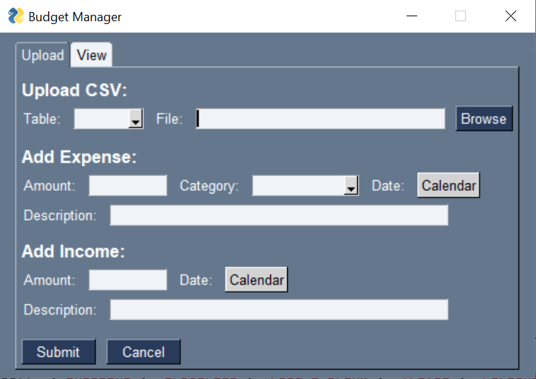
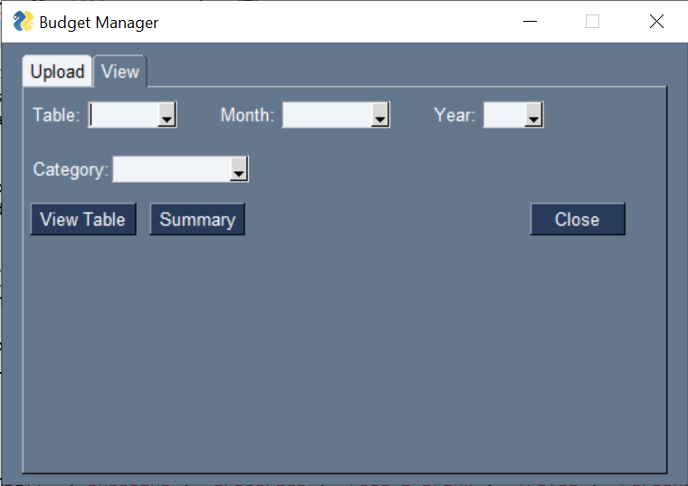
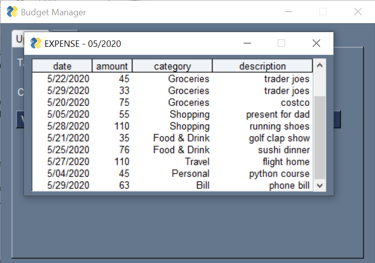
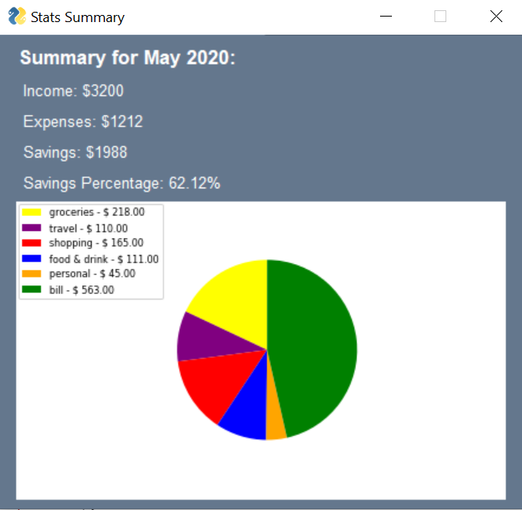

# Budget Manager App 

*Provides the user with a simple way to manage their money - written in Python*

#### &nbsp;1. Upload expenses or income to the database in the form of a CSV file or individual entries.
&nbsp;&nbsp;&nbsp;  

#### &nbsp;2. View expense or income table from database. Specify time period, category, or both.
&nbsp;&nbsp;&nbsp;  &nbsp; 

#### &nbsp;3. View summary of selected period.
&nbsp;&nbsp;&nbsp; 

## &nbsp;Summary
This app was inspired by a monthly process that I used to manage my money in an excel spreadsheet. Personal finance has always been something of great interest to me so this was a perfect project for me to continue to build my programming skills. This was my first time working with a UI. Notable modules used are PySimpleGUI, SQLite, and Matplotlib. 
